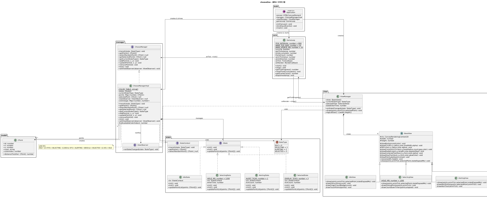

# Choose One - 멀티터치 뽑기 게임

HTML5 Canvas + TypeScript로 개발된 멀티터치 뽑기 게임입니다.  
원본: [chobocho/choose_one](https://github.com/chobocho/choose_one) (Android) 를 웹 포팅

## 게임 방법

1. 화면에 **두 손가락 이상** 올립니다 (PC: 마우스 클릭 + 우클릭으로 테스트)
2. 잠시 기다리면 자동으로 **한 명을 랜덤 선택**합니다
3. 당첨자가 화면에 표시됩니다

## 실행 방법

```bash
# 1. 의존성 설치 (TypeScript 컴파일러)
npm install

# 2. TypeScript 컴파일
npm run build

# 3. 서버 시작
python3 -m http.server 8001
```

브라우저에서 `http://localhost:8001` 접속

## PC 테스트 방법

- **왼쪽 클릭**: 첫 번째 포인트 추가
- **우클릭**: 두 번째 포인트 토글 (뽑기 시작 조건)
- 두 포인트가 있으면 자동으로 뽑기 진행

## 프로젝트 구조

```
chooseOne/
├── index.html          # 메인 HTML
├── src/                # TypeScript 소스
│   ├── main.ts         # 진입점
│   ├── core/
│   │   └── GameLoop.ts # 60fps 게임 루프
│   ├── model/
│   │   └── CPoint.ts   # 터치 포인트 모델
│   ├── state/          # 상태 머신
│   │   ├── IState.ts
│   │   ├── IdleState.ts
│   │   ├── SelectingState.ts
│   │   ├── AlertingState.ts
│   │   └── SelectedState.ts
│   ├── manager/        # 게임 로직
│   │   ├── ChooseManager.ts
│   │   └── ChooseManagerImpl.ts
│   └── view/           # 렌더링
│       ├── BaseView.ts
│       ├── IdleView.ts
│       ├── SelectingView.ts
│       ├── AlertingView.ts
│       ├── SelectedView.ts
│       └── ViewManager.ts
├── dist/               # 컴파일된 JS (tsc 출력)
└── tests/              # 테스트 파일
    └── state.test.html
```

## 게임 상태 흐름

```
IDLE → SELECTING → ALERTING → SELECTED → IDLE
```

- **IDLE**: 손가락을 기다리는 대기 상태
- **SELECTING**: 2개 이상 손가락 감지, 800ms 대기
- **ALERTING**: 선택 직전 강조 애니메이션
- **SELECTED**: 당첨자 표시 (2.4초 후 IDLE로 복귀)

## 아키텍처 다이어그램



> PlantUML 소스: [`docs/architecture.puml`](docs/architecture.puml)

## 기술 스택

- TypeScript 5
- HTML5 Canvas API
- ES2020 모듈
- 외부 라이브러리 없음
